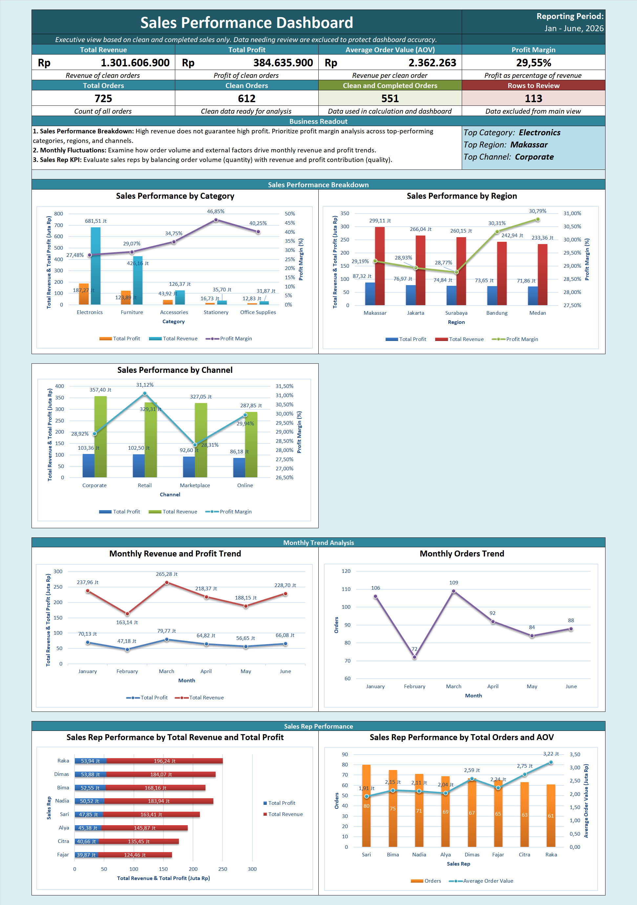

# Sales Performance Analysis

## Project Overview
This project analyzes sales performance dataset using Microsoft Excel to understand revenue drivers, profit patterns, top-performance sales based on category, region, and channel, monthly trend, and sales representative performance. Besides that, this project also documents data quality issues that should be reviewed before making business decisions.

## Dataset
The dataset contains order-level sales records with fields such as:
1. Order ID
2. Order Date
3. Customer Name
4. Category
5. Region
6. Channel
7. Order Status
8. Product ID
9. Product Name
10. Quantity
11. Discount Rate
12. Revenue
13. Cost
14. Profit
15. Sales Representative
16. Quality Flag (to show whether the data is clean or need further review)

*The dataset includes intentional data quality issues such as inconsistent text formatting, date formatting differences, missing values, duplicate order IDs, and some numeric values stored as text.*

&rarr; **The time period of this data is from January,2026 to June, 2026**

## Tools Used 
- Microsoft Excel
- Excel formulas
- Summary tables
- Power Query
- Pivot Table
- Excel dashboard
- GitHub documentation

## Analysis Process
1. Reviewed raw sales order data and data dictionary.
2. Standardized text fields such as region, channel, status, and category.
3. Converted date and numeric fields into analysis-ready values.
4. Reviewed duplicate orders and missing values.
5. Built summary analysis for revenue, profit, order count, average order value, and margin.
6. Created a data cleaning log, business insights, and dashboard preview.

## Data Cleaning Summary
Data cleaning begins by identifying data with issues such as inconsistent text formatting (naming, capitalization, and also abbreviations), missing values, inconsistent date formats, duplicate records, monetary values ​​stored as text with a "Rp" prefix, and datasets containing cancelled or returned orders.

The following is a summary of the data issues identified, along with their counts.
**Data Quality Summary**
| Quality Flag | Rows |
|---|---|
| Clean | 612 |
| Check Quantity | 8 |
| Check Order Date | 18 |
| Check Revenue | 10 |
| Duplicate Order | 5 |
| Review Status | 72 |

*(See the Data Quality Summary sheet in the workbook for the accompanying pie chart.)*

## Dashboard Preview 

## Files
- `dataset-1-sales-performance-raw.xlsx`: raw dataset used for this project
- `dataset-1-sales-performance-analysis.xlsx`: Excel workbook with cleaned data, summaries, dashboard, and insights
- `sales-performance-dashboard.png`: dashboard preview image
- `data-cleaning-log.md`: business-style cleaning documentation
- `business-insights.md`: business question, business insights, and recommended action in 3 scopes (sales performance breakdown, monthly trend, and sales rep performance)

## Summary Metrics
| Metric | Value |
| - | - |
| Clean Revenue | Rp1,301,606,900 |
| Clean Profit | Rp384,635,900 |
| Average Order Value | Rp2,362,262.98 |
| Profit Margin | 29.55% |
| Total Orders | 725 |
| Clean Orders | 612 |
| Clean and Completed Orders | 551 |
| Rows to Review | 113|

- *Clean and completed orders are count of clean and completed orders for calculation and dashboard*
- *Rows to reviews are count of orders needing review (Check Quantity, Check Order Date, Check Revenue, Duplicate Order, and Review Status)*

